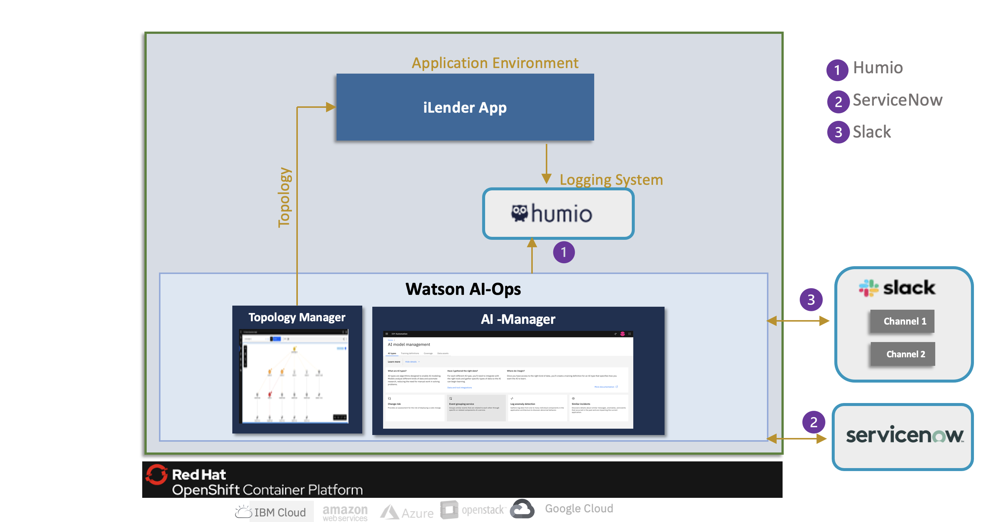

# Watson AIOps 3.3.0 Demo Setup with iLender Application

This article explains about Watson AIOps 3.3.0 demo setup with iLender Application for log anomaly detection.

The article is based on the the following
 - RedHat OpenShift 4.8 on IBM Cloud (ROKS)
 - Watson AIOps 3.3.0

### Operational Architecture

Here is the Operational architecture that we are going to setup.

- OpenShift 4.8 Cluster is installed on IBM Cloud (ROKS)
- Watson AIOps AIManager is installed on this cluster.
- Humio logging system is installed on the same OCP Cluster
- iLender Application is also deployed on the same OCP cluster.

### 1. Watson AIOps 3.3 Installation
<table>
    <tr>
        <td width="4%">S.No</td>
        <td width="84%">Title</td>
        <td width="12%">Reference</td>
    </tr>
    <tr>
        <td>1.1</td>
        <td>Watson AIOps 3.3.0 Installation and demo setup requirements</td>
        <td>

[Details ...](https://community.ibm.com/community/user/aiops/blogs/jeya-gandhi-rajan-m1/2022/05/06/waiops-v33-part-02-watson-aiops-ai-manager-install)
        </td>
    </tr>
    <tr>
        <td>1.2</td>
        <td>Installing Watson AIOps AI-Manager on ROKS</td>
        <td>
[Details ...](https://community.ibm.com/community/user/aiops/blogs/jeya-gandhi-rajan-m1/2022/05/06/waiops-v33-part-02-watson-aiops-ai-manager-install)
        </td>
    </tr>

</table>

### 2. Setup Tools for Integration
<table>
    <tr>
        <td width="4%">S.No</td>
        <td width="28%">Title</td>
        <td width="40%">Description</td>
        <td width="8%">Environment</td>
        <td width="20%">Reference</td>
    </tr>
    <tr>
        <td>3.1</td>
        <td>Install Humio</td>
        <td>Setup Humio in the same OCP Cluster</td>
        <td>OCP Cluster</td>
        <td>

[Details ...](https://community.ibm.com/community/user/aiops/blogs/jeya-gandhi-rajan-m1/2022/05/06/waiops-v33-part-03-installing-humio)</td>
    </tr>   
    <tr>
        <td>3.2 </td>
        <td>Create Slack acccount</td>
        <td>Setup free slack account and create workspace, channels and slack app</td>
        <td>Slack</td>
        <td>[Details](https://community.ibm.com/community/user/aiops/blogs/jeya-gandhi-rajan-m1/2022/05/06/waiops-v33-part-06-slack-account-creation-and-inte)</td>
    </tr>   
    <tr>
        <td>3.3 </td>
        <td>Create ServiceNow Instance</td>
        <td>Procure a ServiceNow Developer Instance</td>
        <td>ServiceNow</td>
        <td>[Details ...](https://developer.servicenow.com/dev.do)
         [Up and Running](https://pages.github.ibm.com/up-and-running/watson-aiops/3.3%20PoC%20Cookbooks/ServiceNow/)</td>
    </tr>
    <tr>
        <td>3.4 </td>
        <td>Install SnowPlugin</td>
        <td></td>
        <td>ServiceNow</td>
        <td>[Details ...](https://github.com/ibm-ecosystem-lab/watson-ai-ops-snow/tree/main/02-snow-waiops-plugin)   
         [Up and Running](https://pages.github.ibm.com/up-and-running/watson-aiops/3.3%20PoC%20Cookbooks/ServiceNow/)</td>
    </tr>
    <tr>
        <td>3.5 </td>
        <td>Create Sample Incidents in Service now</td>
        <td></td>
        <td>ServiceNow</td>
        <td>[Details](https://github.com/ibm-ecosystem-lab/watson-ai-ops-snow/tree/main/01-snow-incidents)</td>
    </tr>
</table>

### 3. Setup Managed Environment
<table>
    <tr>
        <td width="4%">S.No</td>
        <td width="28%">Title</td>
        <td width="40%">Description</td>
        <td width="20%">Reference</td>
    </tr>
    <tr>
        <td>4.1</td>
        <td>Install iLender app</td>
        <td>Install iLender app on the managed environment</td>
        <td>

[Details](https://community.ibm.com/community/user/aiops/blogs/jeya-gandhi-rajan-m1/2022/05/06/waiops-v33-part-04-installing-ilender-app)</td>
    </tr>
</table>

### 4. Setup Data and Tool Configurations
<table>
    <tr>
        <td width="4%">S.No</td>
        <td width="28%">Title</td>
        <td width="48%">Description</td>
        <td width="20%">Reference</td>
    </tr>
    <tr>
        <td>5.1</td>
        <td>Setup Slack Integration</td>
        <td>Integrate with Slack collaboration platform. Need to copy nginx certificate as well.</td>
        <td>

[Details](https://community.ibm.com/community/user/aiops/blogs/jeya-gandhi-rajan-m1/2022/05/06/waiops-v33-part-06-slack-account-creation-and-inte)
</td>
    </tr>
    <tr>
        <td>5.2</td>
        <td>Setup Humio Integration</td>
        <td>&nbsp;</td>
        <td> 
        
[Details](https://community.ibm.com/community/user/aiops/blogs/jeya-gandhi-rajan-m1/2022/05/06/waiops-v33-part-05-create-data-and-tool-integratio)</td>
    </tr>
    <tr>
        <td>5.3</td>
        <td>Setup Servicenow Integration</td>
        <td>&nbsp;</td>
        <td>
[Details](https://community.ibm.com/community/user/aiops/blogs/jeya-gandhi-rajan-m1/2022/05/06/waiops-v33-part-05-create-data-and-tool-integratio)
        </td>
    </tr>
    <tr>
        <td>5.4</td>
        <td>Setup Kubernetes Integration</td>
        <td>&nbsp;</td>
        <td>
[Details](https://community.ibm.com/community/user/aiops/blogs/jeya-gandhi-rajan-m1/2022/05/06/waiops-v33-part-05-create-data-and-tool-integratio)
        </td>
    </tr>    
</table>

### 5. Application Management
<table>
    <tr>
        <td width="4%">S.No</td>
        <td width="76%">Title</td>
        <td width="20%">Reference</td>
    </tr>
    <tr>
        <td>6.1</td>
        <td>Create Application from Resource Groups </td>
        <td>

[Details](https://community.ibm.com/community/user/aiops/blogs/jeya-gandhi-rajan-m1/2022/05/06/waiops-v33-part-07-create-application-in-ai-manage)</td>
    </tr>
</table>

### 6. AI Model Management
<table>
    <tr>
        <td width="4%">S.No</td>
        <td width="76%">Title</td>
        <td width="20%">Reference</td>
    </tr>
    <tr>
        <td>7.1</td>
        <td>Create Training Definition for Log Anomaly Detection </td>
        <td>

[Details](https://community.ibm.com/community/user/aiops/blogs/jeya-gandhi-rajan-m1/2022/05/06/waiops-v33-part-08-create-ai-model-definition)  
        </td>
    </tr>
    <tr>
        <td>7.2</td>
        <td>Create Training Definition for Similar Incidents </td>
        <td>

[Details](https://community.ibm.com/community/user/aiops/blogs/jeya-gandhi-rajan-m1/2022/05/06/waiops-v33-part-08-create-ai-model-definition)  
        </td>
    </tr>    
    <tr>
        <td>7.3</td>
        <td>Enable Story Creation Policy </td>
        <td>

[Details](https://community.ibm.com/community/user/aiops/blogs/jeya-gandhi-rajan-m1/2022/05/06/waiops-v33-part-08-create-ai-model-definition)  
        </td>
    </tr>    
    <tr>
        <td>7.4</td>
        <td>Runbook Automation </td>
        <td>

[Details](https://community.ibm.com/community/user/aiops/blogs/jeya-gandhi-rajan-m1/2022/05/06/waiops-v33-part-09-create-runbook)  
        </td>
    </tr>        
</table>

### 7. Training
<table>
    <tr>
        <td width="4%">S.No</td>
        <td width="28%">Title</td>
        <td width="48%">Description</td>
        <td width="20%">Reference</td>
    </tr>
    <tr>
        <td>8.1</td>
        <td>Generate Load</td>
        <td>Generate the load for the app</td>
        <td>

[Details](https://community.ibm.com/community/user/aiops/blogs/jeya-gandhi-rajan-m1/2022/05/06/waiops-v33-part-10-training)
        </td>
    </tr>    
    <tr>
        <td>8.2</td>
        <td>Log Anomaly Detection training </td>
        <td>Create load in app, enable Data flow on humio integration, selction the mode, start the Log Anomaly Detection training</td>
        <td>[Details](https://community.ibm.com/community/user/aiops/blogs/jeya-gandhi-rajan-m1/2022/05/06/waiops-v33-part-10-training)</td>
    </tr>
    <tr>
        <td>8.4</td>
        <td>Similar Incidents training </td>
        <td>Enable Data flow on Servicenow integration, selction the mode, start the Similar Incidents training</td>
        <td>[Details](https://community.ibm.com/community/user/aiops/blogs/jeya-gandhi-rajan-m1/2022/05/06/waiops-v33-part-10-training)</td>
    </tr>    
</table>

### 8. Inferencing
<table>
    <tr>
        <td width="4%">S.No</td>
        <td width="28%">Title</td>
        <td width="48%">Description</td>
        <td width="20%">Reference</td>
    </tr>
    <tr>
        <td>9.1</td>
        <td>Demo Script </td>
        <td>Prepare demo script to introduce log anomaly and ingest events</td>
        <td>

[Details](https://community.ibm.com/community/user/aiops/blogs/jeya-gandhi-rajan-m1/2022/05/06/waiops-v33-part-11-inferencing)
        </td>
    </tr>
    <tr>
        <td>9.2</td>
        <td>Run Demo </td>
        <td>Run the demo script to induce error in credtiscore service based on the load</td>
        <td>

[Details](https://community.ibm.com/community/user/aiops/blogs/jeya-gandhi-rajan-m1/2022/05/06/waiops-v33-part-11-inferencing)
        </td>
    </tr>
    <tr>
        <td>9.3</td>
        <td>Check Stories on Web and Slack  </td>
        <td>Check the stories created by WA</td>
        <td>

[Details](https://community.ibm.com/community/user/aiops/blogs/jeya-gandhi-rajan-m1/2022/05/06/waiops-v33-part-12-inferencing-view-results)
        </td>
    </tr>
    <tr>
        <td>9.4</td>
        <td>Resolving Incident  </td>
        <td>Resolving Incident</td>
        <td>

[Details](https://community.ibm.com/community/user/aiops/blogs/jeya-gandhi-rajan-m1/2022/05/06/waiops-v33-part-13-inferencing-resolve-incidents)
        </td>
    </tr>    
</table>

