# Create Data and Tool Integrations

This article explains about how to setup below Integration in Watson AIOps.

- Humio Integration
- ServiceNow Integration
- Kubernetes Integration

The article is based on the the following.

- RedHat OpenShift 4.8 on IBM Cloud (ROKS)
- Watson AIOps 3.3.0

## 1. Setup Humio Integration

This section explains about how to setup Humio Integration in Watson AIOps.

1. Goto the page `Data and tool integrations`

2. Click on  `Add Connection`

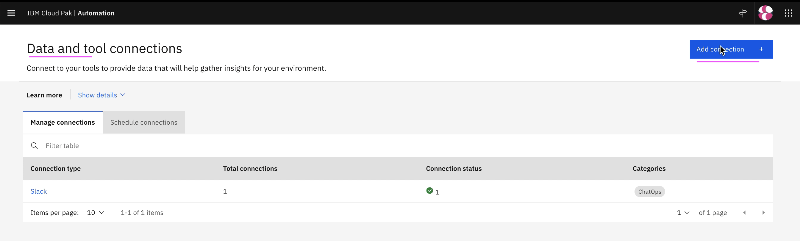

3. In the `Humio` card click on the `Add Connection` link

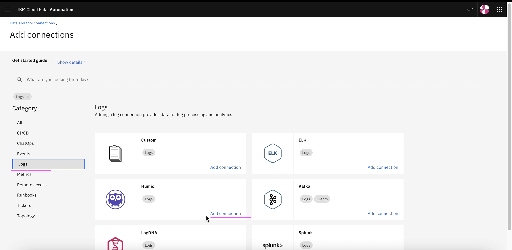

4. Click on `Connect` 

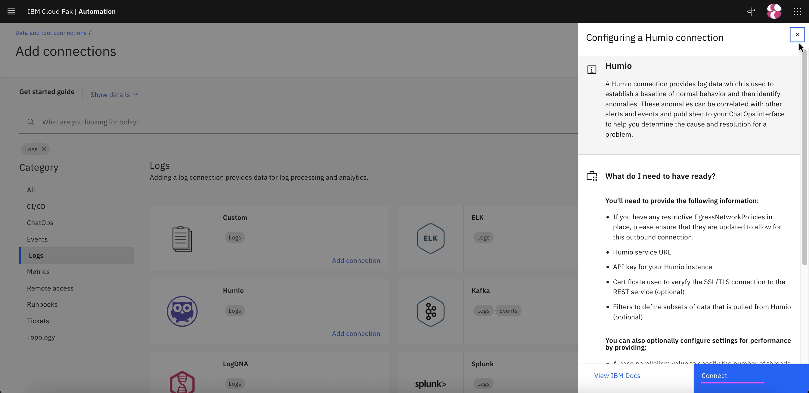

5. Enter the below field values

- Name 
- Description 
- Humio sevice URL

    Sample value : http://humio-humio-ns.aaaaa/api/v1/repositories/sandbox/query

- API Key of the Humio (Should be Account key not the ingestion key)

[Refer ... Installing Humio on RedHat Openshift](../81-installing-humio-on-openshift)

6. Click on `Next` 

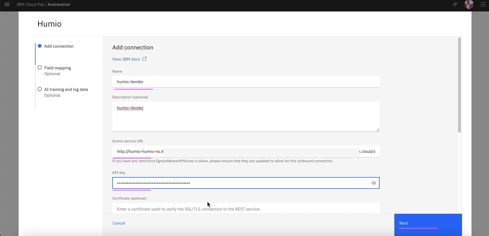

6. Click on `Test Connection` to check the connection with humio

7. Click on `Next`

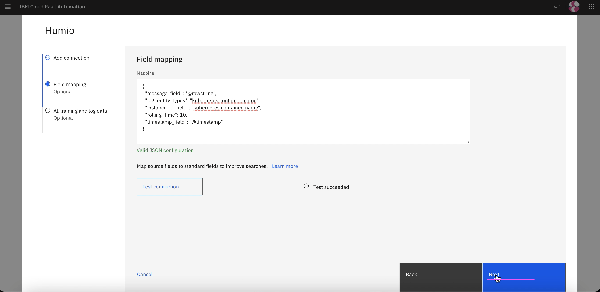

8. Enter the below field values

- Dataflow : Off 
- Mode: Historical ..
- Start Date : yesterday date
- End Date  : tommorrow date

7. Click on `Done`

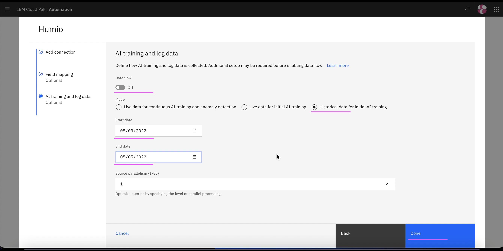

8. Humio connection created

## 2. Setup ServiceNow Integration

This section explains about how to setup ServiceNow Integration in Watson AIOps.

1. Goto the page `Data and tool integrations`

2. Click on  `Add Connection`

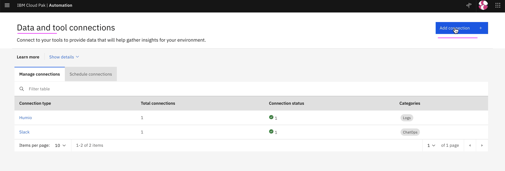

3. In the `ServiceNow` card click on the `Add Connection` link

4. Click on `Connect` 

5. Enter the below field values

- Name 
- Description 
- ServiceNow URL
- User
- Password
- Orchestration : Local

6. Click on `Next` 

7. Click on `Test Connection` to check the connection with humio

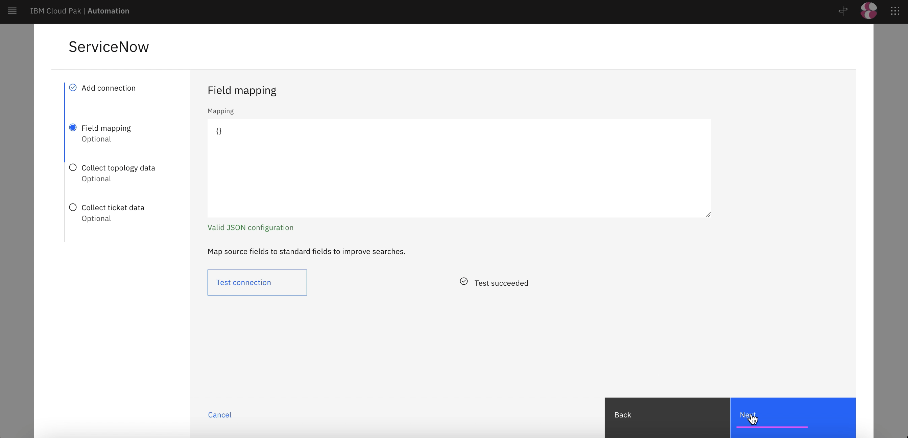

8. Click on `Next`

9. Enter the below field values

- Dataflow : Off 
- Mode: Historical ..  (or any value)
- Start Date : Last year date
- End Date  : tommorrow date

10. Click on `Done`

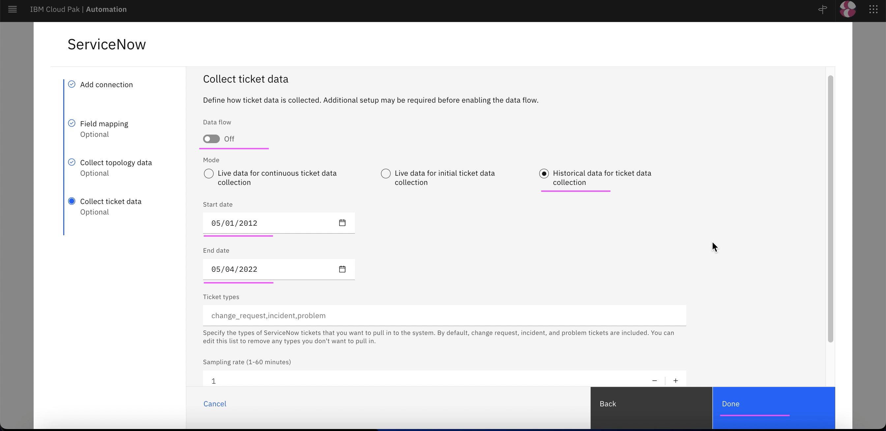

11. ServiceNow connection created

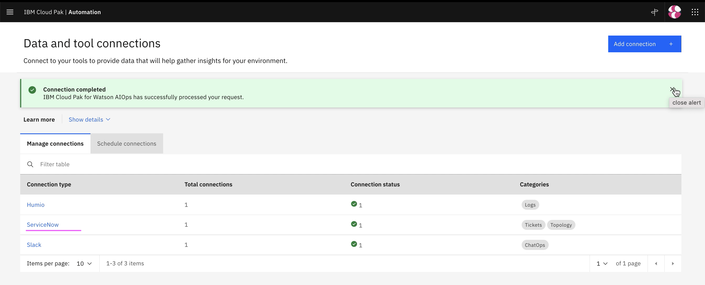

## 3. Setup Kubernetes Integration or Observer

This section explains about how to setup Kubernetes Observer in Watson AIOps.

As part of the kubernetes observer, it is required to communicate with the target cluster. 
Here the target cluster is the local cluster where the AI Manager and iLender app are installed.

Do the following.

## 1. Create Kube Observer Connection

1. Click on `Add Connection`

2. Choose `Topology`

3. Click on `Add Connection` in the `Topology` tile.

3. Click on `Connect`

4. Enter any value in `Name`,  `Description` and `Data Center`

5. Enter the following

 - Connection Type : Local
 - Namespace : ilender-ns  (where you have deployed your app to observe)

6. Enter the following

 - Schedule Request : On
 - Interval : 5

7. Click on `Done`

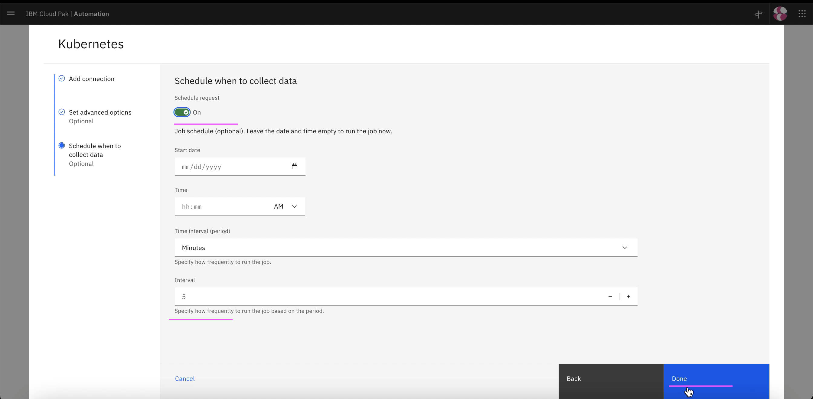

8. Kubernetes connection is created successfully. This might observe the resources found in the given namespace of the kubernetes cluster and create a Resource group

