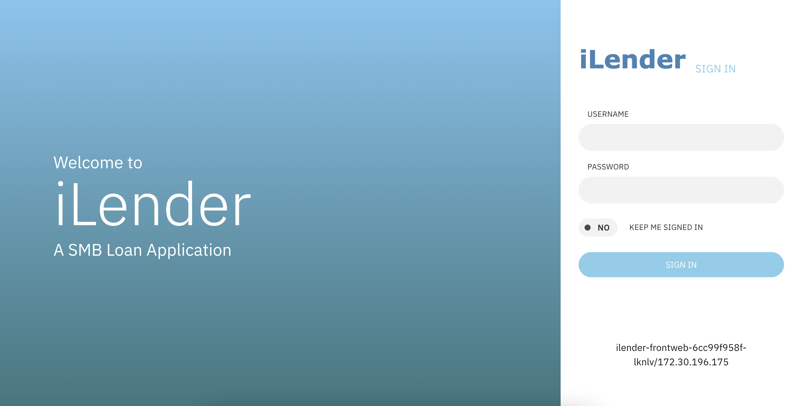

# Installing iLender App

This article explains about how to install iLender demo app and how to generate load in the app for training.

This application can be installed on any of Openshift Cluster.

## 1. Deploying iLender Application

### 1.1 Update Humio properties

Update `humioUrl` and `humioToken` properties in the file `./yaml/20-deployable-common.yaml`

```
  humioUrl: http://1.1.1.1:8080/api/v1/ingest/humio-unstructured
  humioToken: 
```

[Refer ... Installing Humio on RedHat Openshift](../81-installing-humio-on-openshift)


### 1.2. Apply the yaml

Apply the yaml in the Openshift clusters

```
kubectl apply -f ./yaml
```

### 1.3. Access the app

App is installed in the `ilender-ns` namespace.




### 1.4 User Id and Password

```
sam/sam
sandy/sandy
```

### 1.5 URLs

1. Run the below command to print the URL of the Application.

```
APP_URL=$(oc get route -n ilender-ns ilender-frontweb -o jsonpath={.spec.host})
CreditScore_URL=$(oc get route -n ilender-ns ilender-creditscore -o jsonpath={.spec.host})

echo "===================================================================================="
echo "App URL  (ilender-frontweb)                     : http://$APP_URL"
echo "CreditScore Service URL  (ilender-creditscore)  : http://$CreditScore_URL/creditscore"
echo "===================================================================================="
```

2. Example URLs

```
http://ilender-frontweb-ilender-ns.aaaaa.cloud

http://ilender-creditscore-ilender-ns.aaaaa.cloud/creditscore
```


## 2. Generate Load for iLender App

Here we use docker image to create a load. 

### 1. Open the file script file

Open the file `files/01-create-load.sh`

### 2. Update iLender URL

In the above script file, update the below property to point to iLender URL

```
export P_HOST=http://ilender-frontweb-ilender-ns.aaaaa.cloud

```

### 3. Load duration

By default the load is generated for 20 minutes. You can increase it by updating this property. 

```
export P_TIME_DURATION=20m
```

### 4.  Run the load

Run the below script to start the load. It will run for the given time duration and stop automatically.

```
sh files/01-create-load.sh
```

### To Stop the load in-between

To stop the load in the middle you can use the below commands.

```
Jeyas-MacBook-Pro:~ jeyagandhi$ docker ps
CONTAINER ID   IMAGE                               COMMAND      CREATED          STATUS          PORTS     NAMES
d396bd6c2ca8   gandigit/ilender-load-dev-2:0.0.1   "./run.sh"   23 seconds ago   Up 22 seconds             naughty_mendeleev
```

```
Jeyas-MacBook-Pro:~ jeyagandhi$ docker stop d396bd6c2ca8
d396bd6c2ca8
```


