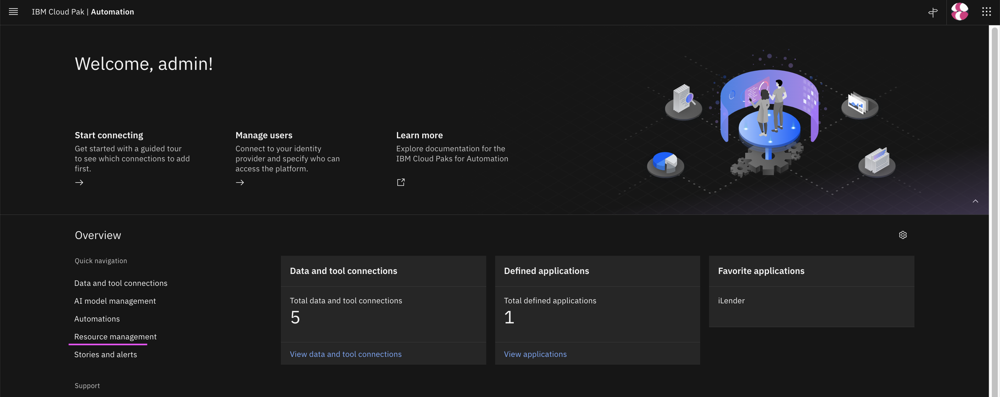
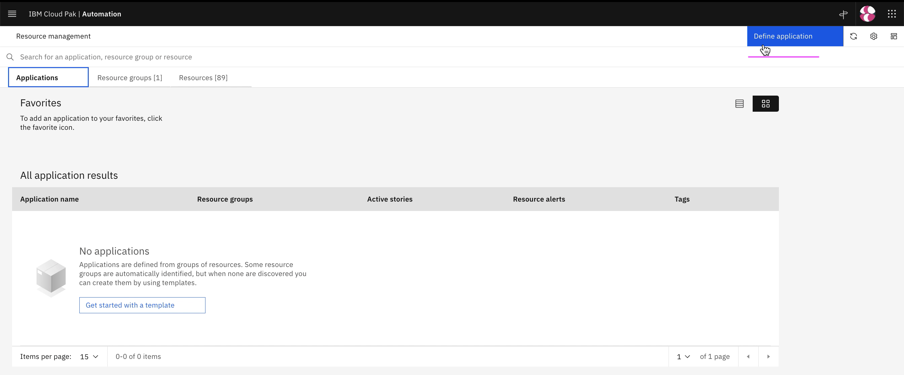
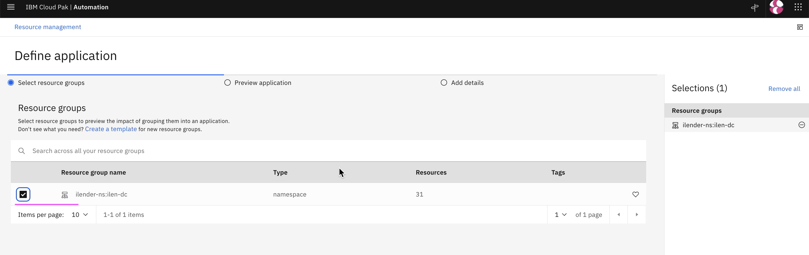
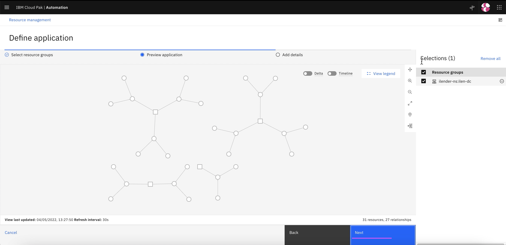
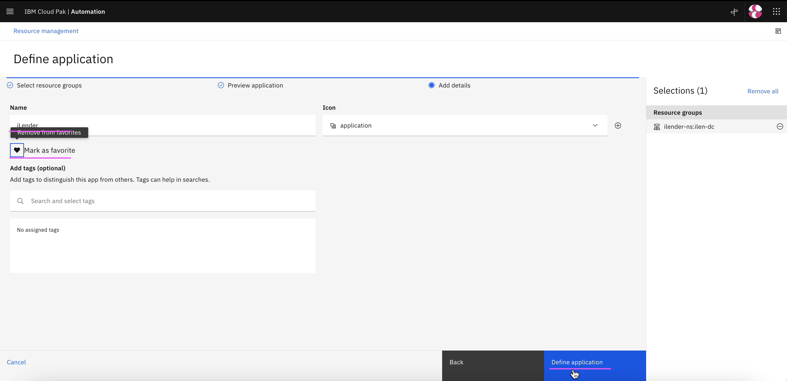
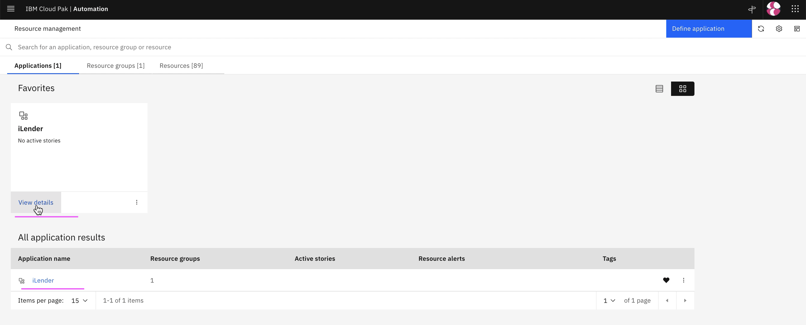
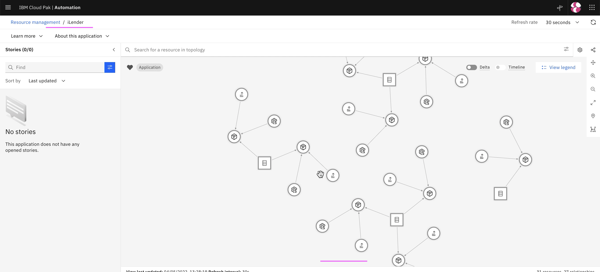

# Create Application in AI-Manager

This article explains about how to Create Application using Kubernetes Observer in Watson AIOps.

The article is based on the the following.

- RedHat OpenShift 4.8 on IBM Cloud (ROKS)
- Watson AIOps 3.3.0

## Pre-Requisite

Kubernetes observer is one of the Integrations that should have been created in WAIOps. This observer would observe all the Kubernetes resources, such as pod, service, deployment, node and etc, available in the given namespace. 

To know how to create kubernetes observer, you can refer the link https://community.ibm.com/community/user/aiops/blogs/jeya-gandhi-rajan-m1/2022/05/06/waiops-v33-part-05-create-data-and-tool-integratio

## Steps

1. Click on `Resource Management`

2. Click on `Define Application`

3. Choose `ilender-ns: ilender-dc`.

This resource group was created by the Kubernetes Observer created before.

4. Click on `Next`

5. Click on `Next`

6. Enter any name to the application

7. Click on `Add to Favourite` link

8. Click on `Define Application`

8. Application is created.

9. Click on `View Details` to see the app details

10. Topology is displayed

