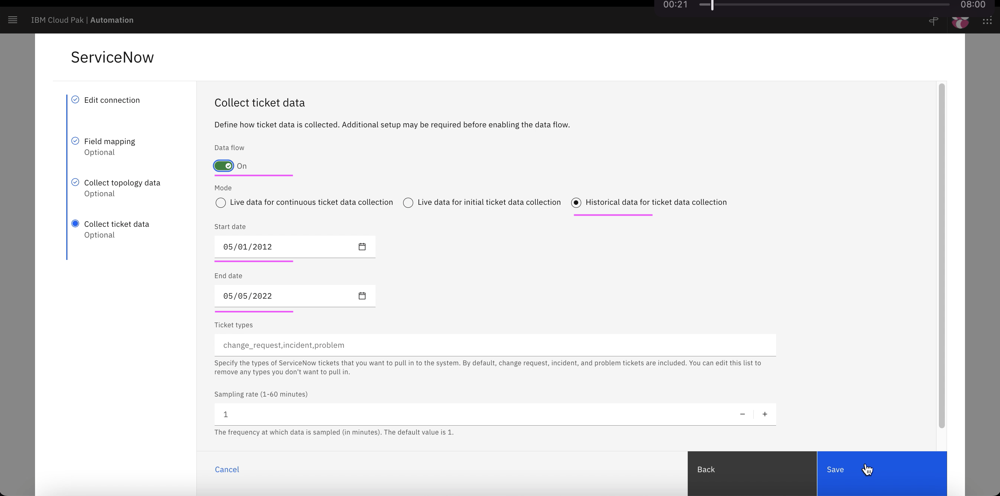

# Training

This article explains about how to do Training for the following in Watson AIOps.

- Log Anomaly detection
- Similar Incidents

The article is based on the the following

- RedHat OpenShift 4.8 on IBM Cloud (ROKS)
- Watson AIOps 3.3.0

## 1. Training - Log Amomaly Detection

### 1.1. Disable Humio Data Flow

Need to disable the Dataflow before generating the load in the application.

1. Make sure the humio DataFlow is disabled.

2. If it is not disabled then disable it.

### 1.2. Application

We use iLender application here. 

Refer : [20-application-installation](../20-application-installation) to know how the app is deployed.

Refer : [1. Deploying iLender Application](https://community.ibm.com/community/user/aiops/blogs/jeya-gandhi-rajan-m1/2021/12/27/waiops-v32-series-03-installing-ilender-app

### 1.3. Generate Load

Generate load in the application for 20 minutes by refering [21-application-load-generation](../21-application-load-generation).

You need to have 10K lines of logs for each service in the application.

This script will run for 20 minutes and stop.

### 1.4. Enable Humio Data Flow

Need to enable the Dataflow before starting the training.

1. Make sure the humio DataFlow is enabled.

2. Enter the below field values

- Custom : On
- Start Date: Yesterday date
- End Date: Tomorrow date

### 1.5. Do Training

1. Goto the page `AI Model Management`

2. Click on `Manage` tab

3. Click on `log-anomaly-detection` link

4. Click on `Edit Data` icon in the `Log Data` section.

5. Enter the below field values

- Custom : On
- Start Date: Yesterday date
- End Date: Tomorrow date

6. Click on `Save`

7. Click on `Start Training` link

The training would start and go for `20 minutes` to `1 hour` based on the data size.

You will have `Training Complete` status once the training is done.

Training is Queued

Training is Queued, but the data is analysed and data quality is good.

Data Retrieval is completed.

Training is completed.

8. Click on `Versions` tab

You can see the version trained and deployed.

9. Click on `Coverage` tab

You can see the iLender application is covered.

10. Click on `View Resources` button

You can see the no. of log lines.

## 2. Training - Similar Incidents

### 2.1. Pre Requisite

#### Sample Incidents for Training

Atleast 5 incidents should have been created in service-now, resolved with proper resolve comments and closed.

Here are the sample incidents from service now.

You can refer to this link to create these incidents in sevicenow. https://github.com/ibm-gsi-ecosystem/watson-ai-ops-snow/tree/main/01-snow-incidents

### 2.2. Enable Data flow for Training

Need to enable the Dataflow before starting the training.

1. Make sure the ServiceNow DataFlow is enabled.

2. Enter the below field values

- Custom : On
- Start Date: Yesterday date
- End Date: Tomorrow date
- Mode: Historical ....

### 2.3. Start Training

1. Goto the page `AI Model Management`

2. Click on `Manage` tab

3. Click on `similar-incidents-configuration` link

4. Click on `Start Training` link.

5. Training starts

The training may take 2 to 5 minutes based on the data size.

Training is Queued

Data is analysed and data quality is good.

Training is completed.

6. Click on `Versions` tab

You can see the version trained and deployed.

7. Click on `Coverage` tab

You can see the iLender application is covered.

