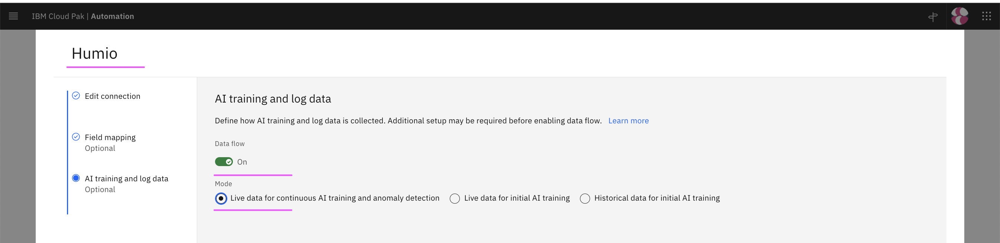
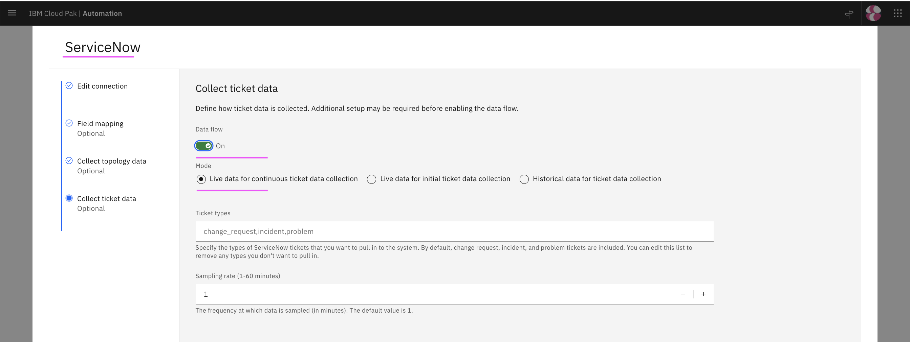
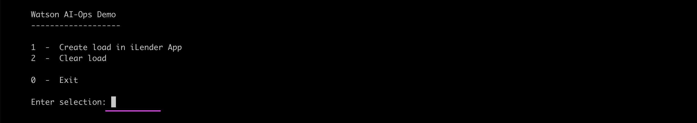

# Inferencing

This article explains about how to do Inferencing of Log Amomaly Detection and Similar incidents in Watson AIOps.

The article is based on the the following

- RedHat OpenShift 4.8 on IBM Cloud (ROKS)
- Watson AIOps 3.3.0


## 1. Demo Script

Need to update few properties in the `config.sh`.

The demo script is avialable [here](./files). 

#### 1.1. Update API_URL Property

Update the API_URL property with application url.

```
API_URL=http://ilender-frontweb-ilender-ns.aaaaa.cloud
```

Refer : [1. Deploying iLender Application](https://community.ibm.com/community/user/aiops/blogs/jeya-gandhi-rajan-m1/2022/05/06/waiops-v33-part-04-installing-ilender-app) to know how the app is deployed.

#### 1.2. Update API_URL_CREDIT_SCORE Url

Update the API_URL_CREDIT_SCORE property with creditscore service url.

```
API_URL_CREDIT_SCORE=http://ilender-creditscore-ilender-ns.aaaaa.cloud/creditscore
```

## 2. Run Demo (Inferencing)

This section explains about how to run the Inferencing demo in Watson AIOps.

### 2.1. Enable Data flow in Humio Integration

1. Choose the `Humio` integration from the `Data and Tool integrations` page.



2. Enable the `Data flow` on.

3. Select the option `Live data for Continious AI training and anomaly detection`.

4. Save it.

### 2.2. Enable Data flow in ServiceNow Integration

1. Choose the `ServiceNow` integration from the `Data and Tool integrations` page.



2. Enable the `Data flow` on.

3. Select the option `Live data for Continious ticket data collection`.

4. Save it.


### 2.3. Run Demo Script

The demo script is avialable [here](../files). 

Run `sh 01-demo.sh` to start the demo.

You will see the menu options like this.



2. 1. Enter `1` to choose the menu option `1  -  Create Loan in iLender App`

The output would be like the below. This will run for 4 minutes.


This demo option will introduce `out of memory error` in the creditscore service based on the increasing load. 

3. As a result, the log anomaly is created and story will be created in the slack.  

## Next Step

By sucessful execution of the above demo step, the story would have been created and you can see them in the next section [Inferencing - View Results](https://community.ibm.com/community/user/aiops/blogs/jeya-gandhi-rajan-m1/2022/05/06/waiops-v33-part-12-inferencing-view-results).


